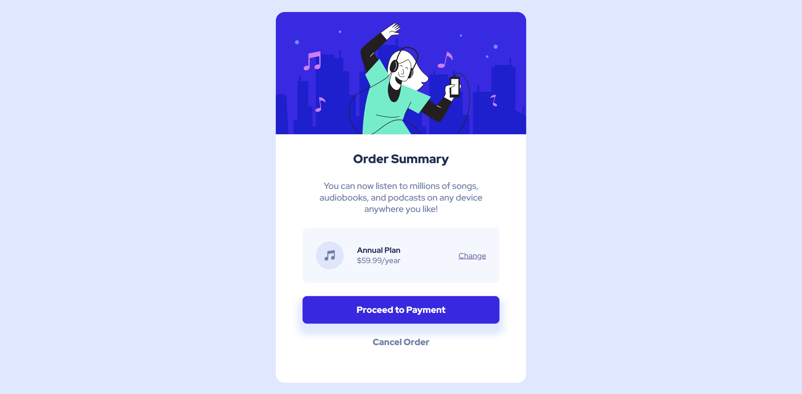

# Frontend Mentor - Order summary card solution

This is a solution to the [Order summary card challenge on Frontend Mentor](https://www.frontendmentor.io/challenges/order-summary-component-QlPmajDUj). Frontend Mentor challenges help you improve your coding skills by building realistic projects. 

## Table of contents

- [Overview](#overview)
  - [The challenge](#the-challenge)
  - [Screenshot](#screenshot)
  - [Links](#links)
- [My process](#my-process)
  - [Built with](#built-with)
  - [What I learned](#what-i-learned)
  - [Continued development](#continued-development)
- [Author](#author)
- [Acknowledgments](#acknowledgments)

## Overview

### The challenge

Users should be able to:

- See hover states for interactive elements

### Screenshot

### Links

- Solution URL: [Add solution URL here](https://github.com/santiagopagura/blog-preview-card-main.git)
- Live Site URL: [Add live site URL here](https://santiagopagura.github.io/order-summary-component-main/)

## My process

### Built with

- Semantic HTML5 markup
- CSS custom properties
- Flexbox
- Mobile-first workflow

### What I learned

I am still learning how to organize the code and how to use the tags correctly. This time I hesitated a lot whether to use the a or button tags. Otherwise I'm still taking a lot of time to take measurements and that's taking up my time. 

### Continued development

Eager to start taking on challenges with JavaScript but first to complete some more with CSS only.

## Author

- LinkedIn - (www.linkedin.com/in/spagura)
- Frontend Mentor - [@santiagopagura](https://github.com/santiagopagura)

## Acknowledgments

I thank Frontend Mentor for providing me with practical challenges to improve my frontend development skills.

